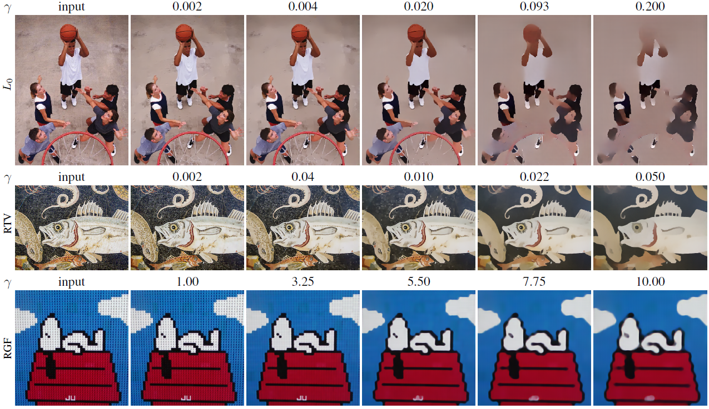
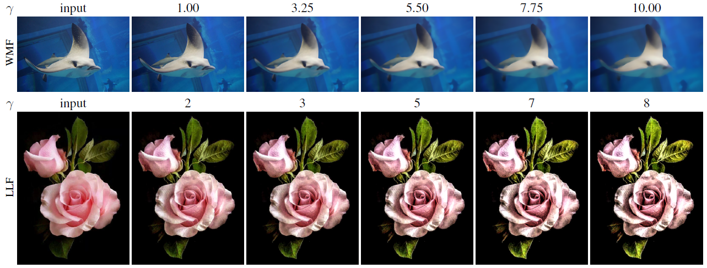
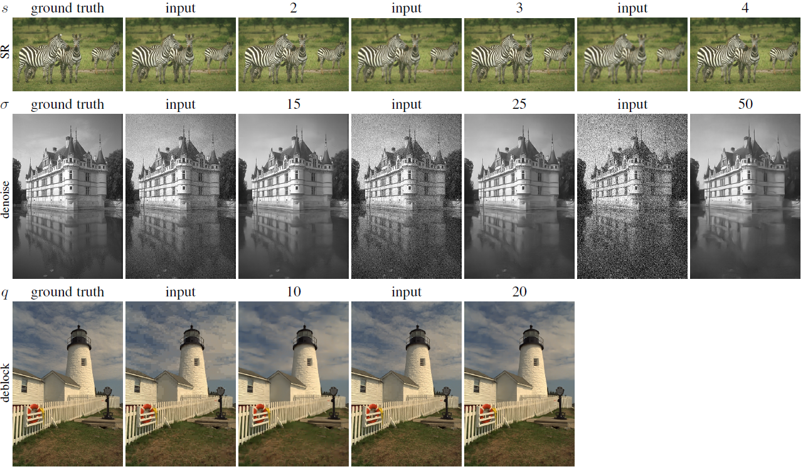

Decouple Learning for Parameterized Image Operators
=======

This is the implementation of ECCV 2018 paper *"Decouple Learning for Parameterized Image Operators"* and TPAMI 2021 paper *"A General Decoupled Learning Framework for Parameterized Image Operators"* by [Qingnan Fan](<https://fqnchina.github.io/>), [Dongdong Chen](<http://www.dongdongchen.bid/>) *et al.*

One network that implements various visual effects by adaptively changing the network weights with controllable continuous input parameters.





Introduction
----
**Decouple Learning** is a technique that successfully incorporates many different parameterised image operators (edge-preserving filter, texture removal, shock filter, super resolution, denoising, derain, deblock, etc.) into one single network. 

**Decouple Learning** does not require retraining or finetuning any other networks for different image operators or different parameter settings for a single operator.

## Getting Started

This paper is implemented with Pytorch framework.

### Demo

Directly run **evaluation_10_operator_model.py** to test our model on the trained ten image operators with different parameter settings, such as smoothness strength, corruption level of input images.

Users can also test our models trained on 6 filtering based operators (**evaluation_6_filter_operator_model.py**), 4 restoration operators (**evaluation_4_restoration_operator_model.py**) or each single operator with different parameters (**evaluation_1_operator_model.py**).

### Data Generation 

Run **training_data_generation.m** in MATLAB to generate the training or test data for the nine image operators mentioned in the paper, which includes L0 smoothing, RTV, WLS, RGF, WMF, shock filter, super resolution, denoising and deblocking. The training data for the derain task is collected from [this paper](<https://github.com/jinnovation/rainy-image-dataset>).

The pre-generated evaluation images used in the paper can be downloaded [here](<https://drive.google.com/open?id=1hJyG5NNEQOal-3jxuroQ2Zxe7mJz7e40>).

The generated training or test images need to be collected into a file list with the same form of **example_filelist.txt** for easy training.

### Training

Directly run **train_10_operator_model.py** to jointly train 10 image operators with different parameter settings.

Users can also choose to train our model on the 6 filtering based operators (**train_6_filter_operator_model.py**), 4 restoration operators (**train_4_restoration_operator_model.py**) or each single operator (**train_1_operator.py**).

### Error metric computation

Compute the PSNR and SSIM error metric by running **compute_error.m** in MATLAB. The ground truth images can be obtained from the above pre-generated evaluation image link.

### Updates

The tpami extension of this paper mainly includes jointly training over ten image operators facilitated with the real-time parameter tuning module. The related codes is in **train_10_operator_model_realtime.py** and **evaluation_10_operator_model_realtime.py**.

Cite
----

You can use our codes for research purpose only. And please cite our papers when you use our codes.
```
@article{fan2018decouple,
  title={Decouple Learning for Parameterized Image Operators},
  author={Fan, Qingnan and Chen, Dongdong and Yuan, Lu and Hua, Gang and Yu, Nenghai and Chen, Baoquan},
  booktitle={European Conference on Computer Vision (ECCV)},
  year={2018}
}
```
```
@article{fan2019decouple,
  title={A General Decoupled Learning Framework  for Parameterized Image Operators},
  author={Fan, Qingnan and Chen, Dongdong and Yuan, Lu and Hua, Gang and Yu, Nenghai and Chen, Baoquan},
  booktitle={IEEE Transactions on Pattern Analysis and Machine Intelligence (TPAMI)},
  year={2019}
}
```
Contact
-------

If you find any bugs or have any ideas of optimizing these codes, please contact me via fqnchina [at] gmail [dot] com


